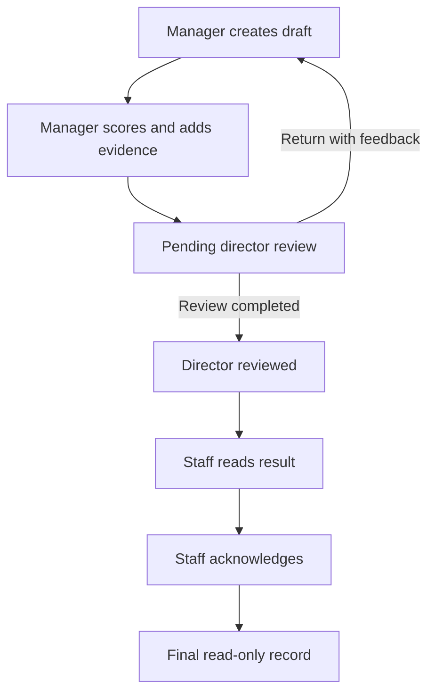
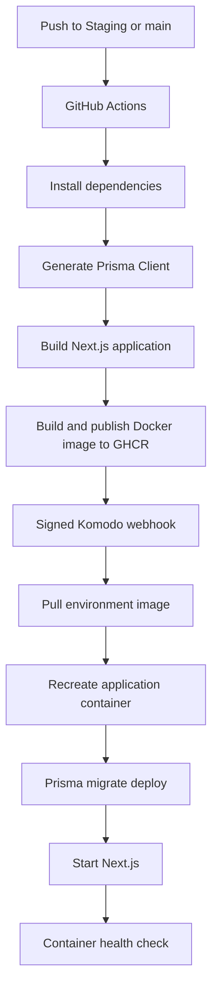

# ProofPoint

**Performance Command Center** — an evidence-driven employee appraisal and observation platform for MAD Labs at Millennia World School.

> **No Evidence, No Score.** Every rating should be explainable, reviewable, and supported by documented evidence.

[](https://github.com/MWS-MAD-Labs/mws-proofpoint/actions/workflows/deploy.yml)
[](https://github.com/MWS-MAD-Labs/mws-proofpoint/releases/latest)

## Current application status

| Item | Current state |
| --- | --- |
| Application version | [`v0.2.0`](https://github.com/MWS-MAD-Labs/mws-proofpoint/releases/tag/v0.2.0) |
| Release stage | Pre-1.0, actively developed and deployed |
| Production | [https://proof.mws.web.id](https://proof.mws.web.id) |
| Staging | [https://proof-stg.mws.web.id](https://proof-stg.mws.web.id) |
| Production branch | `main` |
| Staging branch | `Staging` |
| Database | PostgreSQL 16 managed through Prisma migrations |
| Evidence storage | MinIO, using an S3-compatible API |
| Delivery | GitHub Actions → GHCR → Komodo |

### `v0.2.0` deployment snapshot

The `v0.2.0` release was promoted from staging and deployed to production on **31 July 2026**.

- GitHub Actions test, build, image publication, and deployment jobs passed.
- Production and staging are running the released appraisal and observation workflows.
- All **21 Prisma migrations** were applied successfully in both environments at release time.
- Production application, PostgreSQL, and MinIO containers were healthy with zero restarts after deployment verification.
- The production image is published from `ghcr.io/mws-mad-labs/mws-proofpoint`.

See the [v0.2.0 release notes](https://github.com/MWS-MAD-Labs/mws-proofpoint/releases/tag/v0.2.0) for the full deployment and migration record.

## What the application supports today

### Appraisals

- Evidence-backed self-assessments with automated assignment setup.
- Manager-led staff appraisals that do not require a staff self-assessment first.
- Role- and department-aware staff selection using department role memberships.
- Draft autosave with visible saving, saved, and error feedback.
- Decimal scores from `1.0` through `4.0` with weighted calculations.
- Workflow-aware score comparison: direct self-assessments show Self versus Director, while manager-led appraisals show Manager versus Director.
- Workflow-aware Director scoring: direct self-assessment differences are final overrides, while manager-reviewed score proposals require return feedback and revision.
- Server-side final-score reconciliation before administrative release and result-email delivery.
- Staff acknowledgement of finalized appraisal results.
- Immutable workflow snapshots for in-flight appraisals.
- Lifecycle audit history through `assessment_updates`.
- Read-only print views and generated appraisal PDFs with workflow-aware score breakdowns and signature blocks.

### Observations

- Configurable observation forms and workflows.
- Manager-created observations with evidence, notes, and decimal scoring.
- Draft and reopened observation privacy enforced on the server.
- Submitted observation visibility with read-only staff acknowledgement.
- Reopen, reassignment, submission, and acknowledgement lifecycle controls.
- Draft observations remain in progress rather than overdue after their due date; submission requires moving an expired due date forward.
- Observation due dates are preserved and displayed as timezone-stable calendar dates.
- Role-scoped lists, search, summary counts, filters, and pagination.
- Notification support for observation lifecycle events.
- Configurable acknowledgement reminders after 3 days and every 2 days thereafter.
- Automatic acknowledgement after 30 days, with explicit personal-versus-automatic history and notifications.

### Organization and administration

- Hierarchical departments and sub-departments.
- Searchable department structure with focused department details.
- User management with search (name, email, NIY, job title) plus department, account status, and role filters, and bulk suspend, reactivate, and delete actions.
- Global and department-scoped role management.
- Department role memberships used for workflow authorization and staff eligibility.
- Rubric, KPI framework, observation form, and workflow configuration.
- Administrative assessment review and notification dashboards.

### Strategic planning

- Strategic plans, goals, objectives, programs, targets, budgets, checklists, collaborators, KPI links, progress updates, and evidence.
- Draft, publish, unpublish, print, and reporting flows.

### Experience and accessibility

- Responsive layouts for staff, manager, director, and administrator workspaces.
- Light and dark themes using the MWS-aligned design system.
- Consistent controls, cards, dialogs, forms, status badges, and navigation.
- Keyboard-focusable actions and semantic destructive-action handling in the primary workflows.

## Appraisal workflows

ProofPoint supports both self-led and manager-led appraisal paths. Authorization and lifecycle transitions are enforced by server-side APIs rather than selected directly by clients.

### Manager-led staff appraisal



| Status | Next actor | Available action |
| --- | --- | --- |
| `draft` | Assigned manager | Save or submit |
| `pending_director_review` | Assigned director | Review or return |
| `director_reviewed` | Staff subject | Read and acknowledge |
| `acknowledged` | None | Final read-only record |

### Self-assessment and review

Self-assessments are automatically matched or created for eligible staff. Staff complete scores and evidence, after which the configured manager, director, and administrative review path applies to the assessment.

A direct self-assessment is identified by a self-led assessment with no assigned manager. Its approved result uses the employee's self-ratings as the base and applies Director ratings as item-level final overrides. Differences between Self and Director ratings do not request revision, require item-level revision feedback, or force a return before approval. Director review screens, employee result screens, and print reports label the comparison as Self versus Director, use the same KPI and domain weights at every level, and show only the Director approval signature. Manager-led staff appraisals retain their Manager versus Director comparison, return-for-revision semantics, and manager/director signature flow.

Administrative release recalculates the canonical final score from stored ratings and rubric weights inside the release transaction, persists the corresponding grade, and only then sends the staff result email. This prevents stale client-calculated scores from appearing on acknowledgment pages or in email notifications.

Legacy assessments without a workflow snapshot retain their established lifecycle for backward compatibility.

## Roles and authorization

| Scope | Roles | Current responsibility |
| --- | --- | --- |
| Global | `admin`, `director` | Platform administration, cross-department oversight, review, and approval |
| Root department | `manager`, `staff` | Team management, staff appraisal, self-assessment, and acknowledgement |
| Sub-department | `supervisor`, `staff` | Sub-team responsibility and staff participation |

Important authorization rules include:

- Managers can create staff appraisals only for eligible staff in their managed department scope.
- Only the assigned manager can edit and submit a manager-led draft.
- Only the assigned director, or an authorized administrator override, can complete director review.
- Only the appraisal subject can acknowledge a director-reviewed staff appraisal.
- Staff cannot change manager or director scores, evidence, or feedback.
- Observation subjects cannot access draft or reopened observations unless they have independent privileged access.

## Technology stack

| Area | Technology |
| --- | --- |
| Application | Next.js 15 App Router, React 18, TypeScript |
| Authentication | NextAuth.js 5 beta with PostgreSQL adapter |
| Database | PostgreSQL 16 |
| ORM and migrations | Prisma 7 |
| Evidence storage | MinIO / S3-compatible API |
| Validation and forms | Zod, React Hook Form |
| Data fetching | TanStack Query |
| UI | Tailwind CSS, Radix UI, Lucide icons |
| Email | Nodemailer with configurable SMTP delivery |
| Container runtime | Docker and Docker Compose |
| CI/CD | GitHub Actions, GitHub Container Registry, Komodo |

## Local development

### Prerequisites

- Node.js 20+
- npm
- Docker with Docker Compose

### Setup

1. Clone the repository:

   ```bash
   git clone https://github.com/MWS-MAD-Labs/mws-proofpoint.git
   cd mws-proofpoint
   ```

2. Install dependencies:

   ```bash
   npm ci
   ```

3. Create `.env.local` and configure the local environment. Keep credentials out of version control.

   Configure at minimum:

   ```text
   DATABASE_URL
   NEXTAUTH_URL
   NEXTAUTH_SECRET
   POSTGRES_PASSWORD
   MINIO_ACCESS_KEY
   MINIO_SECRET_KEY
   ```

   Observation notification policy, reminder timing, automatic acknowledgement, and the scheduler interval are stored in PostgreSQL. After migrations are applied, administrators manage them from **Administration → Notification settings**; no observation acknowledgement environment variables are required.

   Google authentication additionally requires:

   ```text
   GOOGLE_CLIENT_ID
   GOOGLE_CLIENT_SECRET
   ```

4. Start PostgreSQL and MinIO. You may use the provided Compose configuration or equivalent local services.

5. Apply migrations and generate Prisma Client:

   ```bash
   npm run db:migrate:deploy
   npm run db:generate
   ```

6. Start the development server:

   ```bash
   npm run dev
   ```

7. Open [http://localhost:3000](http://localhost:3000).

For Google OAuth in local development, register:

```text
http://localhost:3000/api/auth/callback/google
```

If using the Compose application port, register:

```text
http://localhost:3060/api/auth/callback/google
```

## Useful commands

| Command | Purpose |
| --- | --- |
| `npm run dev` | Start the local Turbopack development server |
| `npm run build` | Generate Prisma Client and build the production application |
| `npm run lint` | Run ESLint across the repository |
| `npm run db:generate` | Generate Prisma Client |
| `npm run db:migrate:dev` | Create/apply migrations during development |
| `npm run db:migrate:deploy` | Apply committed migrations in a deployed environment |
| `npm run db:migrate:rebaseline` | One-time guarded migration-history repair for existing pre-baseline databases |
| `npm run db:studio` | Open Prisma Studio |
| `npm run db:seed` | Run the primary development seed |
| `npm run db:seed:it-support-appraisal` | Intentionally create the IT Support appraisal fixture |

The IT Support seed is optional and is **not** run automatically during deployment.

## Deployment

### Branch and image mapping

| Git branch | Environment | Container tag |
| --- | --- | --- |
| `Staging` | Staging | `ghcr.io/mws-mad-labs/mws-proofpoint:staging` |
| `main` | Production | `ghcr.io/mws-mad-labs/mws-proofpoint:latest` |

Each image is also published with a commit-specific tag such as `staging-<sha>` or `main-<sha>` for traceability and rollback planning.

### Delivery flow



The application container runs `prisma migrate deploy` before starting Next.js. If migrations fail, application startup stops instead of serving code against an incompatible schema.

The long-lived Next.js Node process starts the observation acknowledgement scheduler through `src/instrumentation.ts`. It runs shortly after application startup and hourly thereafter by default. PostgreSQL advisory locking ensures that only one application replica processes a scheduler cycle. See the [observation acknowledgement automation runbook](./docs/operations/observation-acknowledgement-automation.md).

### Deployment verification

After deployment, verify:

```bash
npx prisma migrate status
```

Also confirm:

- The running image revision matches the deployed Git commit.
- Application, PostgreSQL, and MinIO containers are healthy.
- Application logs contain `Prisma migrations complete` and no startup error.
- Public pages return `200`.
- Protected APIs return `401` for unauthenticated requests rather than `404` or `500`.

## Database and migration policy

- Database changes must be committed as ordered Prisma migrations under `prisma/migrations`.
- The active history starts at the verified `20260812000000_existing_database_baseline`; earlier incomplete files are retained outside the active path for audit context.
- Existing environments created before that baseline require the one-time [Prisma migration history rebaseline](./docs/operations/prisma-migration-history-rebaseline.md) before deploying this history.
- Deployments use `prisma migrate deploy`; production must not use `prisma db push`.
- Migrations are forward-only. Take a database backup before releases with schema changes.
- Application rollback after new workflow data is written may require database restoration or a compatibility assessment.
- Workflow snapshots protect in-flight appraisals from later workflow configuration changes.

## Repository health

At `v0.2.0` release time:

- Prisma schema validation passed.
- The optimized Next.js production build passed.
- GitHub Actions CI/CD passed for staging and production.
- ESLint completed with no errors; existing warnings remain technical-debt follow-up work.
- Observation authorization and lifecycle logic has focused domain and database-backed integration coverage.

## Documentation

- [v0.2.0 release notes](https://github.com/MWS-MAD-Labs/mws-proofpoint/releases/tag/v0.2.0)
- [Manager-led staff appraisal specification](./docs/specs/manager-led-staff-appraisals.md)
- [Appraisal, observation, and department UX specification](./docs/specs/appraisal-observation-and-department-ux.md)
- [UX implementation plan](./docs/specs/appraisal-observation-and-department-ux-plan.md)
- [UX task and validation record](./docs/specs/appraisal-observation-and-department-ux-tasks.md)
- [Strategic planning specification](./docs/specs/strategic-planning.md)
- [Production data migration runbook](./docs/operations/production-data-migration.md)
- [Prisma migration history rebaseline runbook](./docs/operations/prisma-migration-history-rebaseline.md)
- [Production-to-staging database refresh runbook](./docs/operations/staging-database-refresh.md)
- [Observation acknowledgement automation runbook](./docs/operations/observation-acknowledgement-automation.md)
- [Global observation notification settings development plan](./docs/specs/global-observation-notification-settings-plan.md)
- [Multi-teacher observations implementation and compatibility plan](./docs/specs/multi-teacher-observations-development-plan.md)
- [Multi-teacher observations rollout runbook](./docs/operations/multi-teacher-observations-rollout.md)

## Release versioning

ProofPoint follows [Semantic Versioning](https://semver.org/). While the platform remains below `1.0.0`:

- Minor versions may introduce substantial backward-compatible product functionality.
- Patch versions contain backward-compatible fixes and operational improvements.
- Breaking schema, workflow, or integration changes must be clearly documented in release notes and deployment runbooks.

## License

ProofPoint is open source under the [MIT License](./LICENSE).

You may use, copy, modify, merge, publish, distribute, sublicense, and sell copies of the software, provided that the copyright and license notice are included in copies or substantial portions of the software.

Copyright © 2026 MAD Labs, Millennia World School.
