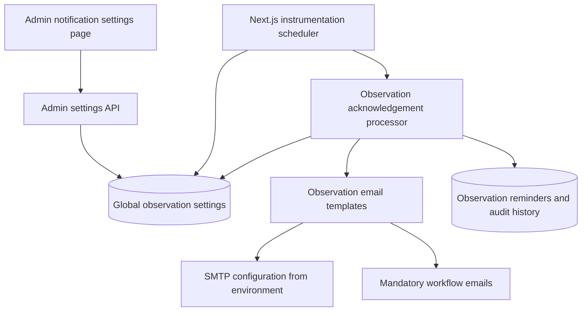

# Global Observation Notification Settings — Development Plan

**Status:** Implemented

**Scope:** Observation workflow email policy, acknowledgement reminder timing, and automatic acknowledgement timing

**Out of scope:** SMTP credentials, appraisal notification preference behavior, and changes to existing observation lifecycle states

**Delivery summary:** The singleton PostgreSQL settings model, administrator API, paginated audit-history UI, scheduler observability, runtime scheduler/processor/email-policy cutover, administrator settings page, user preference cleanup, focused automated coverage, migration CI, and deployment/runbook cleanup are implemented. The legacy `notification_preferences.observation_updates` database column is intentionally retained for the documented one-release rollback-compatibility period and is no longer read or updated by the application.

## 1. Objective

Move observation notification policy and acknowledgement timing from deployment environment variables and per-user preferences into one administrator-managed global configuration stored in PostgreSQL.

Observation workflow emails are mandatory operational communications. Individual users must not be able to disable them. Administrators can change global behavior and timing from the ProofPoint admin interface without rebuilding or restarting the application.

The resulting ownership model is:

| Concern | Source of truth |
| --- | --- |
| Observation notification and timing policy | Global PostgreSQL settings managed by administrators |
| Scheduler and workflow behavior | Deployed application code |
| SMTP server and credentials | Deployment environment variables/secrets |
| Appraisal notification preferences | Existing per-user notification preferences |

## 2. Implemented state

The observation acknowledgement automation:

- runs inside the long-lived Next.js Node process through `src/instrumentation.ts`;
- reads global policy and timing from PostgreSQL before processing cycles;
- defaults to a first reminder after 3 days, repeats every 2 days, and automatic acknowledgement after 30 days;
- uses a fixed internal 30-second scheduler startup delay;
- uses PostgreSQL advisory locking for multi-replica safety;
- prevents duplicate reminder periods in `observation_acknowledgement_reminders`;
- treats observation workflow emails as global operational communications rather than per-user preferences;
- exposes administrator-managed settings, scheduler status, and paginated audit history at `/admin/notification-settings` through admin-only APIs;
- validates fresh PostgreSQL 16 migration replay and schema drift in CI;
- runs database integration tests only through `npm run test:observations:integration`, guarded by a distinct `TEST_DATABASE_URL` whose database name ends in `_test`; and
- no longer uses `OBSERVATION_ACK_*` or `OBSERVATION_AUTO_ACK_DAYS` environment variables.

The implementation changes the policy source without replacing the scheduler, processor, email templates, audit history, or idempotency mechanisms.

## 3. Target behavior

### 3.1 Mandatory observation workflow notifications

The following observation emails follow the global policy and cannot be disabled by individual users:

- observation submitted and waiting for acknowledgement;
- acknowledgement reminders;
- personal acknowledgement confirmation;
- automatic acknowledgement notification;
- observation reopened;
- observation reassigned.

The existing unused initial-assignment template is not automatically activated by this project. Activating it requires a separate product decision because current observation creation assigns the creator as observer.

### 3.2 Administrator-managed settings

Administrators can configure:

| Setting | Type | Default | Validation |
| --- | --- | ---: | --- |
| Observation notifications enabled | Boolean | `true` | — |
| Submission emails enabled | Boolean | `true` | — |
| Reminder emails enabled | Boolean | `true` | — |
| First reminder delay | Integer days | `3` | `1–90` |
| Repeat reminder interval | Integer days | `2` | `1–90` |
| Automatic acknowledgement enabled | Boolean | `true` | — |
| Automatic acknowledgement deadline | Integer days | `30` | `1–365` and greater than first reminder delay when reminders are enabled |
| Personal acknowledgement confirmation emails enabled | Boolean | `true` | — |
| Automatic acknowledgement emails enabled | Boolean | `true` | — |
| Reopen emails enabled | Boolean | `true` | — |
| Reassignment emails enabled | Boolean | `true` | — |
| Scheduler enabled | Boolean | `true` | — |
| Scheduler interval | Integer minutes | `60` | `5–1440` |

The scheduler startup delay remains an internal code constant. It is an implementation detail rather than a business setting.

### 3.3 Immediate application of changes

The scheduler must read current global settings before each processing cycle. Changes to timing and enablement therefore take effect without an application restart.

For a scheduler interval change, the running scheduler must reread the interval before scheduling its next cycle. A setting saved during an already-running cycle affects the following cycle.

## 4. Architecture



### 4.1 Security boundary

Only authenticated administrators may read or update global observation settings through the admin API.

SMTP values remain outside the admin UI and database:

- `EMAIL_ENABLED`
- `EMAIL_SERVICE`
- `EMAIL_FROM`
- `EMAIL_FROM_NAME`
- `SMTP_HOST`
- `SMTP_PORT`
- `SMTP_SECURE`
- `SMTP_USER`
- `SMTP_PASSWORD`

The API must never return or accept SMTP credentials.

## 5. Data model

### 5.1 New singleton settings table

Add a Prisma migration and model for a singleton table, for example `observation_notification_settings`:

```text
id                                  integer primary key, constrained to 1
notifications_enabled               boolean not null default true
submission_emails_enabled           boolean not null default true
reminder_emails_enabled             boolean not null default true
first_reminder_days                 integer not null default 3
reminder_interval_days              integer not null default 2
automatic_acknowledgement_enabled   boolean not null default true
automatic_acknowledgement_days      integer not null default 30
personal_ack_email_enabled          boolean not null default true
automatic_ack_email_enabled         boolean not null default true
reopen_emails_enabled               boolean not null default true
reassignment_emails_enabled         boolean not null default true
scheduler_enabled                   boolean not null default true
scheduler_interval_minutes          integer not null default 60
updated_by_id                       uuid null references users(id)
created_at                          timestamp not null default current_timestamp
updated_at                          timestamp not null default current_timestamp
```

Use database `CHECK` constraints for numeric ranges and the singleton identifier. Seed the singleton row in the migration with defaults matching the currently deployed behavior.

### 5.2 Settings update history

Global policy changes should be auditable. Preferred implementation:

- add `observation_notification_setting_updates` with the actor, timestamp, and before/after JSON snapshots; or
- integrate with an existing administrator audit facility if one is introduced before implementation.

At minimum, persist `updated_by_id` and `updated_at`. Full before/after history is recommended because timing changes affect employee workflow deadlines.

### 5.3 Existing user preference column

`notification_preferences.observation_updates` becomes obsolete.

Safe rollout sequence:

1. Stop reading the column in application code.
2. Remove the **Observation Updates** toggle from the user settings API and page.
3. Leave the database column in place for one release to support rollback compatibility. **Current state:** retained; application references have been reduced to compatibility coverage and schema/migration documentation.
4. Remove the column in a later cleanup migration after the new behavior is stable and rollback no longer requires the old application behavior.

Do not change appraisal preference columns.

## 6. Backend implementation

### 6.1 Global settings service

Add a server module such as:

```text
src/features/observations/server/notificationSettings.ts
```

Responsibilities:

- read the singleton settings row;
- return code defaults if the row is unexpectedly missing;
- validate update input;
- update settings transactionally;
- record the administrator actor and audit history;
- expose a typed settings object to the scheduler, processor, and notification sender.

Avoid process-lifetime caching initially. A direct database read per scheduler cycle and admin update is simple and ensures immediate consistency. Request-level reads for observation lifecycle emails may use a short bounded cache later if measurements justify it.

### 6.2 Admin API

Add:

```text
GET /api/admin/observation-notification-settings
PUT /api/admin/observation-notification-settings
```

Requirements:

- require an authenticated `admin` role;
- reject unknown fields;
- validate numeric ranges and cross-field rules with Zod;
- return camelCase JSON consistent with existing APIs;
- update all fields transactionally;
- record `updatedById` and an audit entry;
- never expose deployment secrets.

Suggested response shape:

```ts
interface ObservationNotificationSettings {
  notificationsEnabled: boolean;
  submissionEmailsEnabled: boolean;
  reminderEmailsEnabled: boolean;
  firstReminderDays: number;
  reminderIntervalDays: number;
  automaticAcknowledgementEnabled: boolean;
  automaticAcknowledgementDays: number;
  personalAcknowledgementEmailsEnabled: boolean;
  automaticAcknowledgementEmailsEnabled: boolean;
  reopenEmailsEnabled: boolean;
  reassignmentEmailsEnabled: boolean;
  schedulerEnabled: boolean;
  schedulerIntervalMinutes: number;
  updatedAt: string;
  updatedBy: { id: string; name: string | null; email: string } | null;
}
```

### 6.3 Scheduler changes

Update `observationAcknowledgementScheduler.ts`:

- keep the internal startup delay and PostgreSQL advisory lock;
- read global settings before each run;
- skip processing when `schedulerEnabled` or `notificationsEnabled` is false, while logging the reason;
- after each run, read the current `schedulerIntervalMinutes` before scheduling the next run;
- use a safe code default of 60 minutes when settings cannot be read;
- do not rely on `OBSERVATION_ACK_SCHEDULER_*` environment variables after migration.

A database outage must not permanently stop the timer. Log the error and schedule another attempt using the code fallback interval.

### 6.4 Processor changes

Update `processAcknowledgementAutomation.ts` to accept the loaded settings or retrieve them once at the beginning of the cycle.

Rules:

- when reminders are disabled, do not claim or send reminder periods;
- use `firstReminderDays` and `reminderIntervalDays` from global settings;
- when automatic acknowledgement is disabled, never update an observation automatically;
- use `automaticAcknowledgementDays` from global settings;
- continue requiring `status = 'submitted'`, `acknowledged_at IS NULL`, matching `submitted_at`, and an automation start timestamp;
- continue preventing duplicate reminder periods;
- continue allowing personal acknowledgement to take priority;
- retain all existing audit and response history behavior.

Do not calculate due dates in the browser.

### 6.5 Observation email sender changes

Replace `isObservationNotificationEnabled(userId)` with global event-policy checks.

The sender must not read:

- `notification_preferences.email_enabled`; or
- `notification_preferences.observation_updates`

for mandatory observation emails.

Each event maps to a global flag:

| Event | Global flag |
| --- | --- |
| Observation submitted | `submissionEmailsEnabled` |
| Reminder | `reminderEmailsEnabled` |
| Personal acknowledgement | `personalAcknowledgementEmailsEnabled` |
| Automatic acknowledgement | `automaticAcknowledgementEmailsEnabled` |
| Reopen | `reopenEmailsEnabled` |
| Reassignment | `reassignmentEmailsEnabled` |

`notificationsEnabled` is the master switch. SMTP `EMAIL_ENABLED` remains the final infrastructure-level delivery switch.

## 7. Admin frontend

### 7.1 Navigation and page

Add an administrator-only page, preferably:

```text
/admin/notification-settings
```

If the existing `/admin` surface uses tabs or sections, integrate the page using the established admin navigation pattern rather than creating a disconnected layout.

### 7.2 Interface sections

#### Master control

- Enable observation workflow notifications
- Explain that these notifications are mandatory globally and cannot be disabled by individual users

#### Submission and acknowledgement

- Submission notification toggle
- Personal acknowledgement confirmation toggle

#### Reminder policy

- Reminder notification toggle
- First reminder delay in days
- Repeat reminder interval in days
- Show a human-readable preview, for example: “First reminder after 3 days, then every 2 days.”

#### Automatic acknowledgement

- Automatic acknowledgement toggle
- Deadline in days
- Automatic acknowledgement notification toggle
- Warning that automatic acknowledgement records that the staff member did not personally acknowledge

#### Lifecycle changes

- Reopen notification toggle
- Reassignment notification toggle

#### Scheduler

- Scheduler enabled toggle
- Check interval in minutes
- Explain that this controls how soon due work is discovered, not the policy deadline itself

### 7.3 UX requirements

- Use existing cards, labels, switches, inputs, buttons, validation messages, and toast patterns.
- Disable dependent numeric inputs when their feature is disabled.
- Show unsaved-change state.
- Prevent duplicate save requests.
- Display last-updated time and administrator when available.
- Confirm disabling automatic acknowledgement because it changes deadline enforcement.
- Preserve keyboard access, responsive layout, and light/dark theme support.

### 7.4 User notification settings cleanup

Update `/settings/notifications`:

- remove the **Observation Updates** toggle;
- add explanatory text that observation workflow emails are managed globally and may be mandatory;
- retain all appraisal notification preferences and the global email toggle for appraisal emails;
- clarify that the global email toggle does not disable mandatory observation workflow communications.

This wording must accurately reflect backend enforcement.

## 8. Environment and deployment cleanup

Remove these business settings from application and deployment configuration after the database-backed settings are active:

```text
OBSERVATION_ACK_SCHEDULER_ENABLED
OBSERVATION_ACK_SCHEDULER_INTERVAL_MINUTES
OBSERVATION_ACK_FIRST_REMINDER_DAYS
OBSERVATION_ACK_REMINDER_INTERVAL_DAYS
OBSERVATION_AUTO_ACK_DAYS
```

`OBSERVATION_ACK_SCHEDULER_INITIAL_DELAY_SECONDS` should also be removed and replaced by an internal code constant.

Update:

- `env.example`;
- `docker-compose.yml`;
- `README.md`;
- `docs/operations/observation-acknowledgement-automation.md`.

Retain SMTP and database environment variables.

## 9. Migration and rollout strategy

### Phase 1 — Schema and read service

1. Add the singleton settings table with current defaults.
2. Add settings read/update service and API.
3. Add audit tracking.
4. Keep existing environment behavior as an emergency fallback only during development.

### Phase 2 — Admin interface

1. Add the administrator settings page.
2. Add validation and save feedback.
3. Verify role access and mobile/keyboard behavior.

### Phase 3 — Runtime cutover

1. Make scheduler and processor use database settings.
2. Make observation emails ignore per-user preferences and use global flags.
3. Remove the user Observation Updates toggle.
4. Remove observation business settings from Compose and `env.example`.

### Phase 4 — Cleanup

Implementation cleanup is complete: the user toggle and API shape were removed, deployment environment settings were removed, and operations documentation now points to the database-backed administrator settings. Operational staging/production verification remains a deployment activity. In a later release, remove `notification_preferences.observation_updates` after rollback compatibility is no longer required.

## 10. Backward compatibility

- Existing observations remain unchanged.
- Existing reminder records remain valid.
- Existing acknowledgement method, date, note, response, and audit history remain unchanged.
- Existing pending observations that were not enrolled by the acknowledgement automation migration remain unenrolled unless reopened and submitted again.
- The initial global settings row must exactly reproduce current defaults, preventing timing changes at deployment.
- Appraisal email preferences continue to behave as before.

## 11. Testing plan

### 11.1 Unit tests

- settings defaults and database-to-domain mapping;
- numeric range and cross-field validation;
- reminder period calculations using supplied global settings;
- automatic acknowledgement deadline using supplied global settings;
- scheduler interval selection and fallback;
- global event-to-email-toggle mapping.

### 11.2 API integration tests

- unauthenticated and non-admin access rejected;
- admin can read settings;
- admin can update valid settings;
- invalid ranges and unknown fields rejected;
- update actor and audit history recorded;
- settings persist across requests.

### 11.3 Automation integration tests

Extend the existing observation database integration harness to cover:

- reminders use the configured first delay and interval;
- reminders are not claimed when globally disabled;
- automatic acknowledgement is not performed when disabled;
- automatic acknowledgement uses the configured deadline;
- scheduler skips when globally disabled;
- scheduler uses the updated interval on its next scheduling decision;
- advisory-lock skip behavior remains intact;
- duplicate, stale-submission, personal-acknowledgement, failed-send retry, and preference-suppression tests are updated for global policy.

### 11.4 Email tests

- every event respects its global flag;
- master switch disables all observation emails;
- user `email_enabled = false` and `observation_updates = false` do not suppress mandatory observation emails;
- SMTP-disabled mode remains non-failing and does not expose credentials;
- reminder and automatic acknowledgement copy retains the required staff, observer, title, deadline explanation, and direct link.

### 11.5 Browser validation

As an administrator:

- desktop and mobile layout;
- keyboard-only operation;
- light and dark themes;
- valid save flow;
- invalid numeric values;
- dependent controls when sections are disabled;
- last-updated details;
- confirmation for disabling automatic acknowledgement.

As a non-admin:

- admin page and API are inaccessible.

As a regular user:

- Observation Updates toggle is absent;
- appraisal preferences remain editable;
- explanatory mandatory-notification text is visible.

## 12. Observability and operations

Scheduler logs should include:

- settings revision or `updatedAt` used for the cycle;
- enabled/disabled decision;
- configured interval and deadlines;
- checked, sent, skipped, auto-acknowledged, and error counts;
- advisory-lock skip events.

Do not log recipient email content, SMTP credentials, or acknowledgement responses.

The admin page should not become a scheduler execution control. It must not include “run now,” redeploy, restart, or secret-management actions in the initial implementation.

## 13. Acceptance criteria

1. Administrators can view and update one global observation notification policy from ProofPoint.
2. Changes take effect without rebuilding or restarting the application.
3. Observation workflow emails no longer depend on per-user notification settings.
4. Appraisal notification preferences continue to work per user.
5. SMTP credentials remain deployment secrets and never appear in the admin UI or API.
6. Default global settings reproduce the existing 3-day, 2-day, and 30-day behavior.
7. Disabled reminders create no reminder claim records and send no reminder emails.
8. Disabled automatic acknowledgement never changes observation status.
9. Personal acknowledgement continues to take priority over automatic acknowledgement.
10. Duplicate reminder prevention and submission-cycle guards remain intact.
11. Scheduler advisory locking remains effective across multiple application replicas.
12. Existing observation history and acknowledgement responses are preserved.
13. The user settings page no longer presents an ineffective Observation Updates toggle.
14. Migration, unit, integration, build, and authenticated browser validation pass before production rollout.

## 14. Delivered sequence

The feature was implemented as one coordinated application change:

1. Singleton schema, settings service, validation, audit metadata, and administrator API.
2. Scheduler and processor cutover to current database settings with a fixed internal startup delay.
3. Mandatory observation event-policy cutover independent of per-user appraisal preferences.
4. Administrator settings UI with validation, policy previews, dirty-state handling, save protection, and disable-confirmation behavior.
5. User settings/API/type cleanup while retaining every appraisal preference and leaving the legacy database column in place.
6. Environment, Compose, README, runbook, and plan cleanup.

Staging and production rollout checks remain operational responsibilities and are not implied solely by implementation status.
