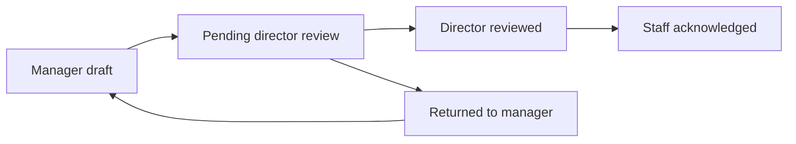

# Manager-led staff appraisals

## Purpose

Regular staff appraisals do not start with self-assessment. An assigned manager creates and scores the appraisal, the assigned director reviews it, and the staff member acknowledges the final record.

Manager self-appraisals remain separate: a manager completes their own appraisal and sends it to a director for review.

## Staff appraisal lifecycle

| Status | Actor with next action | Action |
| --- | --- | --- |
| `draft` | Assigned manager | Save or submit the appraisal |
| `pending_director_review` | Assigned director | Review or return it to the manager |
| `director_reviewed` | Staff subject | Read results and acknowledge |
| `acknowledged` | None | Final, read-only record |

## Staff appraisal rubric mode

Staff appraisals use the dedicated `STAFF_APPRAISAL` template type. This mode models the rubric as:

1. Part
2. Area of performance
3. Performance item with an item percentage
4. Four anchored rating descriptions for scores 4, 3, 2, and 1

An item percentage is a relative weight used by the original appraisal spreadsheet. The manager's final score is calculated as `Σ(rating × item percentage) ÷ Σ(item percentage)`. Percentages are not rebalanced or required to total 100%; their total is used only as the divisor, preserving the existing 1–4 grade scale (`Exemplary`, `Trail Blazers`, and so on).

The storage reuses the domain/standard/KPI hierarchy, but the editor and appraisal screens use staff-appraisal terminology and hide the self-assessment comparison column. KPI frameworks and observation forms cannot be selected when starting a staff appraisal.

## Configuration

Admins assign a KPI appraisal workflow and a `STAFF_APPRAISAL` rubric to a staff department role. The supported manager-led workflow has these ordered steps:

1. `manager / FILL_FORM`
2. `director / REVIEW` or `APPROVE`
3. `staff / ACKNOWLEDGE`

The creation API rejects a manager-led staff appraisal unless the selected rubric has this exact active assignment for the staff member's department role.

## Authorization

- A manager may create an appraisal only for active staff in the same department; admins may work across departments.
- Only the assigned manager may edit or submit a draft.
- Only the assigned director (or admin override) may review or return an appraisal.
- Only the staff subject may acknowledge a director-reviewed appraisal.
- Staff cannot change scores, evidence, or manager/director feedback.

## Data retention and compatibility

New appraisals persist the selected workflow, assignment, and a `workflow_snapshot`. The snapshot prevents workflow configuration edits from changing the lifecycle of an in-flight record.

`assessment_updates` records every lifecycle event. Existing assessments with no workflow snapshot are treated as legacy records and retain the original flow, including admin release where it was previously required.

## Endpoints

| Endpoint | Use |
| --- | --- |
| `POST /api/assessments` with `staff_id` | Manager creates a staff appraisal draft |
| `GET /api/assessments/staff` | Eligible staff list for the manager creation screen |
| `PATCH /api/assessments/:id/action` | Lifecycle actions: `save_draft`, `submit`, `director_review`, `return`, `acknowledge` |

The action endpoint enforces both actor authorization and valid status transitions. Clients must not select a raw next status for manager-led appraisals.
