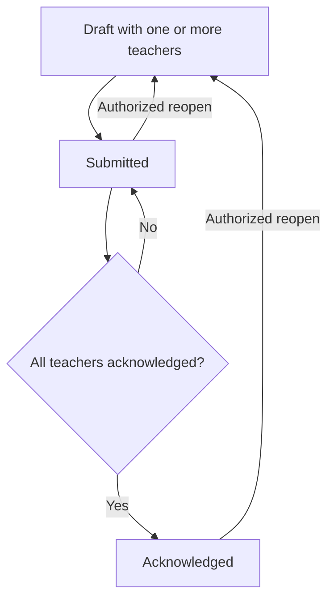

# Multi-Teacher Observations — Development Plan

**Status:** Implemented compatibility release; staging deployment candidate

**Implemented migration:** `20260828000000_multi_teacher_observation_foundation`

**Scope:** Allow one observation to cover multiple observed teachers at class or subject level

**Primary outcome:** One shared observation report can name multiple teachers, while access, acknowledgement, reminders, notifications, audit history, and reporting remain correct for each teacher

**Out of scope:** Timetable management, student records, automatic class-roster synchronization, replacing the current observation rubric/workflow system, and removal of legacy compatibility columns

## 1. Objective

Before this compatibility release, ProofPoint required one `staffId` for every observation. This modeled an observation as a report about one teacher, but classroom and subject observations may involve co-teachers, teaching assistants, specialist teachers, or other staff participating in the same lesson.

The implemented behavior lets an authorized observer select one or more eligible teachers and create one shared observation containing:

- one observer;
- one rubric and answer set;
- one observation date, due date, title, and description;
- optional class and subject context;
- multiple observed teachers;
- an independent acknowledgement state and response for every observed teacher.

This project must not create duplicate observation reports for the same event. Scores, notes, evidence, lifecycle history, and print output belong to the shared observation; acknowledgement belongs to each observed teacher.

## 2. Product decisions

The compatibility release implements the following rules:

| Concern | Implemented rule |
| --- | --- |
| Number of teachers | At least 1 and at most 20 active eligible staff per observation |
| Shared content | All selected teachers share the same rubric answers, scores, notes, evidence, title, dates, and observer |
| Form eligibility | A form is selectable only when its active workflow assignment is valid for every selected teacher |
| Teacher visibility | Draft and reopened observations remain hidden from observed teachers; submitted observations are visible to every selected teacher |
| Acknowledgement | Each observed teacher acknowledges independently and may provide their own response |
| Observation completion | The observation becomes `acknowledged` only after every current participant is personally or automatically acknowledged |
| Participant changes | Teachers may be added or removed only while the observation is in `draft`; at least one teacher must remain |
| Self-observation | The observer cannot be included as an observed teacher |
| Counting | Observation lists and summary cards count the shared observation once, not once per teacher |
| Acknowledgement privacy | A teacher may view their own acknowledgement response; observer, admin, and director access follows existing privileged observation access. Teachers must not see another teacher's private acknowledgement response |
| Class/subject context | Store optional snapshot text initially; integration with a canonical timetable or SIS is a separate project |

### 2.1 Aggregate lifecycle

The existing observation lifecycle remains recognizable:



While the observation is `submitted`, individual participants may be pending, personally acknowledged, or automatically acknowledged. The top-level status changes to `acknowledged` only when no participant remains pending.

## 3. Implemented state and compatibility impact

The implementation now uses participant records throughout the observation workflow:

- `ObservationParticipant`, mapped to `observation_participants`, stores membership and per-teacher acknowledgement state;
- acknowledgement reminders are owned and deduplicated by participant and submission cycle;
- `POST /api/observations` accepts `staffIds` and temporarily accepts legacy `staffId` input;
- `POST /api/observations/available-forms` returns the intersection valid for every selected teacher;
- permissions use participant membership and the current participant's acknowledgement state;
- list, summary, detail, search, notification, and automation queries remain one row per shared observation while resolving all participants;
- API and TypeScript response shapes expose deterministic `participants` arrays and aggregate acknowledgement progress;
- the creation wizard and draft editor provide accessible multi-select participant management;
- class and subject context are stored as snapshot text;
- acknowledgement responses are private to the participant and existing privileged viewers.

The release deliberately retains legacy `Observation.staffId` and observation-level acknowledgement columns for compatibility. New multi-teacher behavior reads participant records as the source of truth. The legacy `staffId` is maintained as a deterministic compatibility value and must not be interpreted as the complete participant list.

Rolling application code back below this compatibility release is unsafe after a multi-teacher observation is created. See the [multi-teacher observation rollout runbook](../operations/multi-teacher-observations-rollout.md).

## 4. Target data model

### 4.1 Observation participant table

Add a join model such as `ObservationParticipant`, mapped to `observation_participants`:

```text
id                                       uuid primary key
observation_id                           uuid not null references observations(id) on delete cascade
staff_id                                 uuid not null references users(id) on delete restrict
acknowledged_at                          timestamp null
acknowledgement_method                   text null
acknowledgement_response                 text null
acknowledgement_note                     text null
acknowledgement_automation_started_at    timestamp null
created_at                               timestamp not null default current_timestamp
updated_at                               timestamp not null default current_timestamp

unique (observation_id, staff_id)
index (staff_id, observation_id)
index (observation_id, acknowledged_at)
```

Recommended constraints:

- `acknowledgement_method` is null or one of `personal`, `automatic`;
- `acknowledgement_method` is null when `acknowledged_at` is null;
- each observation must have at least one participant, enforced transactionally in application code because a normal row constraint cannot enforce parent-child cardinality;
- participants must be active users with an eligible staff role when added. Historical records remain valid if a participant later becomes inactive.

The `User` model should expose a participant relation such as `observationParticipations`, while `Observation` exposes `participants`.

### 4.2 Acknowledgement reminders

Acknowledgement automation is per teacher, so reminder ownership must move from the observation to the participant.

Preferred change:

```text
observation_acknowledgement_reminders
  participant_id uuid not null references observation_participants(id) on delete cascade
  submission_at timestamp not null
  reminder_period integer not null
  ...

unique (participant_id, submission_at, reminder_period)
```

Keeping only `observation_id` would incorrectly prevent or combine reminders for different teachers in the same observation.

### 4.3 Observation context

Add optional snapshot fields to `observations`:

```text
scope_type     text not null default 'INDIVIDUAL'
class_name     text null
subject_name   text null
```

Allowed `scope_type` values should initially be:

- `INDIVIDUAL`;
- `CLASS`;
- `SUBJECT`.

Validation rules:

- multi-teacher observations should use `CLASS` or `SUBJECT`;
- `class_name` is required for `CLASS` scope;
- `subject_name` is required for `SUBJECT` scope;
- both snapshot fields may be present when useful, such as a subject lesson within a named class;
- values are snapshots and must not change if a future external class or subject record is renamed.

If the product does not need structured scope filtering in the first release, these fields may be deferred while still delivering multi-teacher selection. Do not introduce class, subject, or timetable tables solely for this feature.

### 4.4 Legacy columns

During the compatibility release, retain these existing observation-level fields:

- `staffId`;
- `acknowledgedAt`;
- `acknowledgementMethod`;
- `acknowledgementResponse`;
- `acknowledgementNote`;
- `acknowledgementAutomationStartedAt`.

After all application reads and writes use participant records, remove the legacy columns in a later migration. The application must not indefinitely maintain two writable sources of truth.

## 5. Migration and compatibility strategy

Use a staged forward-only rollout.

### Phase A — Additive schema

1. Create `observation_participants` and participant-based reminder support.
2. Add optional observation context fields.
3. Backfill exactly one participant for every existing observation from `observations.staffId`.
4. Copy existing acknowledgement and automation values into the backfilled participant.
5. Migrate existing reminder rows to that participant.
6. Verify that every observation has one or more participant rows and that no duplicate `(observation_id, staff_id)` pairs exist.

The migration must fail rather than silently skip an observation whose legacy staff user cannot be resolved.

### Phase B — Compatible application release

1. Read participants as the source of truth.
2. Accept new `staffIds` input and temporarily accept legacy `staffId` input for internal backward compatibility.
3. Return `participants` in observation API responses.
4. Optionally retain a deprecated `staff` response only when there is exactly one participant, if an incremental frontend rollout requires it.
5. Write acknowledgement data only to participant records.
6. Derive top-level completion from participant acknowledgement states.
7. Update all observation queries, permissions, notifications, exports, tests, and UI.

If both `staffId` and `staffIds` are sent, reject the request with `400` rather than guessing intent.

### Phase C — Cleanup migration

After production verification and rollback assessment:

1. remove legacy request and response fields;
2. remove observation-level acknowledgement columns and `staffId`;
3. remove old indexes, constraints, and relations;
4. make participant-based reminder ownership mandatory;
5. update operational documentation and release notes.

Take a production database backup before Phase A and Phase C. An application rollback after multi-teacher observations are created requires a compatibility assessment because older code cannot represent more than one participant.

## 6. Backend implementation

### 6.1 Creation API

Change `POST /api/observations` to accept:

```ts
interface CreateObservationInput {
  staffIds: string[];
  rubricId: string;
  workflowId?: string;
  title?: string;
  description?: string;
  observationDate?: string;
  dueAt: string;
  scopeType?: "INDIVIDUAL" | "CLASS" | "SUBJECT";
  className?: string;
  subjectName?: string;
}
```

Server validation must:

- reject an empty array, duplicates, more than 20 IDs, and malformed IDs;
- load all selected users in one query and reject missing or inactive users;
- ensure every selected user has an eligible staff role;
- ensure the observer is not selected;
- enforce manager department scope for every selected user;
- verify that the requested workflow/rubric assignment is valid for every selected user;
- validate scope and context fields;
- create the observation, all participant rows, and the creation audit entry in one transaction.

The response should expose `participants: PersonSummary[]` in deterministic name/email order.

### 6.2 Available forms

Replace the single `staffId` lookup with a multi-teacher request. Prefer a `POST` endpoint when sending the selection because arrays in query strings become unwieldy:

```text
POST /api/observations/available-forms
{ "staffIds": ["...", "..."] }
```

Return the intersection of active observation forms valid for all selected teachers. The server remains the authority; the creation API must repeat this check to prevent stale or manipulated client submissions.

When no common form exists, return an empty result with a user-facing explanation that the selected teachers do not share an assigned observation workflow.

### 6.3 Permissions and confidentiality

Replace equality checks against one `staffId` with participant membership checks.

Required rules:

- admin/director privileges continue to follow the existing centralized policy;
- only the assigned observer or existing authorized override may edit, submit, reopen, reassign, or delete;
- an observed teacher is any user with a participant row for the observation;
- all observed teachers are denied draft/reopened detail and answer access unless they independently have privileged access;
- after submission, each observed teacher can view the shared report;
- only a pending participant may personally acknowledge their own participation;
- one teacher cannot acknowledge for another teacher;
- participant membership must be applied consistently to lists, filtered totals, summary counts, search, pagination, direct detail, answer routes, print routes, and notifications.

Update `ObservationAccessRecord` and `getObservationPermissions` so authorization accepts participant IDs or a precomputed `isParticipant` value. Avoid placing unbounded arrays into general authorization objects when a SQL `EXISTS` check is more appropriate.

### 6.4 Acknowledgement endpoint

`PATCH /api/observations/:id/acknowledge` must lock the current user's participant row and the parent observation in one transaction.

Processing sequence:

1. confirm the observation is submitted, or is automatically acknowledged for this participant and eligible for personal replacement under the existing policy;
2. confirm the current user has a participant row;
3. write only that participant's response, timestamp, method, and note;
4. record an audit event that identifies the participant without exposing private response text in general activity history;
5. count remaining unacknowledged participants while locks are held;
6. set the parent observation to `acknowledged` only when the remaining count is zero;
7. commit before sending notifications.

The endpoint should be idempotent for a participant who already personally acknowledged.

### 6.5 Reopen behavior

Reopening returns the shared observation to `draft` and starts a new review cycle.

In one transaction:

- set the parent status to `draft` and record `reopenedAt`/history using current conventions;
- clear current participant acknowledgement timestamps, methods, responses, notes, and automation start values;
- invalidate or separate reminders from the previous `submittedAt` cycle;
- preserve prior acknowledgement facts in immutable audit history before clearing current-cycle fields;
- notify the observer and privileged users according to existing policy, but do not expose the reopened draft to participants.

Participant membership may be changed only after the reopen transaction completes and the observation is a draft.

### 6.6 Reassignment

Observer reassignment remains a parent observation action. Validation must ensure the new observer:

- has an authorized observer role;
- has scope over every participant under the existing department rules;
- is not one of the observed teachers.

### 6.7 Query and reporting changes

Update SQL carefully to avoid multiplying observations by participant count.

- Use `EXISTS` for participant-based visibility and filters.
- Use a lateral subquery or JSON aggregation for participant summaries.
- Keep pagination and summary totals at observation level.
- Search should match any participant's full name or email, plus existing observation fields.
- Add an optional participant filter for “observations involving teacher X”.
- Show aggregate acknowledgement progress such as `2 of 3 acknowledged`.
- Print/PDF output should list every observed teacher and show per-teacher acknowledgement method/date without exposing other teachers' private response text.
- CSV/analytics exports must define whether one row represents an observation or an observation participant. Existing observation-level reports should remain one row per observation unless explicitly renamed as participant reports.

## 7. Acknowledgement automation and notifications

### 7.1 Per-participant automation

The scheduler must process pending participant rows rather than pending observations.

For each submitted observation participant:

- start or retain that participant's automation window for the current submission cycle;
- send reminders only to that participant;
- deduplicate by participant, submission timestamp, and reminder period;
- automatically acknowledge only that participant after the configured deadline;
- after each automatic acknowledgement, atomically complete the parent observation only if every participant is acknowledged;
- allow a participant's later personal acknowledgement to replace only their own automatic acknowledgement under the existing replacement policy.

One participant's acknowledgement must not stop reminders for another pending participant.

### 7.2 Notification recipients

- On submission, notify every observed teacher separately.
- Acknowledgement reminders and automatic acknowledgement messages go only to the affected teacher.
- Personal acknowledgement may notify the observer with aggregate progress.
- Send a final completion notification when the last participant acknowledges.
- Reassignment and reopen notifications must use the existing confidentiality rules.
- Email templates should use plural language and list teachers only when the recipient is allowed to see the participant list.

Notification sends must remain outside database transactions and retain current retry/idempotency protections.

## 8. Frontend implementation

### 8.1 Creation wizard

Replace the single-select staff control with an accessible searchable multi-select.

Required behavior:

- selected teachers appear as removable chips or a clear selected list;
- keyboard users can search, add, inspect, and remove selections;
- duplicate selections are impossible;
- the observer cannot be selected;
- show department and role context to disambiguate names;
- selection changes invalidate the chosen form if it is no longer common to all teachers;
- show a clear empty state when selected teachers share no form;
- default titles use class/subject context or a concise multi-teacher label rather than concatenating many names;
- the review step lists every selected teacher and the acknowledgement rule;
- unsaved-change protection includes teacher and context changes.

Use plural copy throughout: “Select teachers”, “3 teachers selected”, and “Observed teachers”. Preserve singular grammar when only one teacher is selected.

### 8.2 Observation lists and cards

- Show the first few teacher names and a `+N more` indicator where space is limited.
- Provide the full list in an accessible details surface or tooltip that is not required for core understanding.
- Display acknowledgement progress for submitted observations.
- Keep each shared observation as one card and one pagination item.
- Ensure mobile layouts wrap names without horizontal overflow.

### 8.3 Detail and report views

- Replace the single staff profile block with an observed-teachers section.
- For an observed teacher, show their own acknowledgement action and state.
- For observer/admin/director views, show the state of every participant.
- Do not render another participant's private acknowledgement response to a teacher without privileged access.
- Update print styles and generated PDF layouts for long teacher lists.

## 9. Audit history

Audit events should distinguish shared lifecycle actions from participant actions.

Suggested event types:

- `created`;
- `participant_added`;
- `participant_removed`;
- `submitted`;
- `participant_acknowledged`;
- `participant_auto_acknowledged`;
- `all_participants_acknowledged`;
- `reopened`;
- `reassigned`.

Participant events should store the affected `staffId` in structured metadata or a dedicated nullable column rather than relying only on human-readable notes. Private acknowledgement response text should remain on the participant record or protected response history, not in broadly visible audit notes.

## 10. Delivery increments

### Increment A — Domain and migration foundation

- Reconcile schema and SQL naming.
- Add participant and context models.
- Backfill existing observations and reminders.
- Add migration verification queries and rollback notes.

### Increment B — Read path and authorization

- Update types, detail/list/summary queries, search, permissions, and print data.
- Preserve single-teacher behavior through backfilled participant rows.
- Add database-backed confidentiality and pagination tests before enabling multi-select creation.

### Increment C — Multi-teacher creation

- Add `staffIds` validation and common-form intersection.
- Build the accessible multi-select creation experience.
- Add class/subject context inputs if included in the release.

### Increment D — Per-teacher acknowledgement

- Move acknowledgement, automation, reminders, responses, and notifications to participants.
- Add aggregate completion behavior and reopen reset handling.

### Increment E — Cleanup and rollout completion

- Validate production data and application metrics.
- Remove compatibility fields in a later release.
- Update README current capabilities only after the feature is deployed.

## 11. Testing and validation

### 11.1 Migration tests

- Every legacy observation receives exactly one participant.
- Existing personal and automatic acknowledgement values are preserved.
- Existing reminders map to the correct participant without duplicates.
- Migration fails safely for orphaned or invalid legacy data.

### 11.2 API and domain tests

- Create observations with 1, 2, and 20 teachers.
- Reject zero, duplicate, missing, inactive, ineligible, out-of-scope, self, and more than 20 teachers.
- Reject a rubric/workflow not common to every selected teacher.
- Ensure creation is atomic if any participant insert fails.
- Verify draft confidentiality for every participant.
- Verify submitted visibility for every participant and denial for unrelated staff.
- Verify one teacher cannot acknowledge for another.
- Verify partial acknowledgement keeps the parent submitted.
- Verify the last acknowledgement completes the parent exactly once under concurrent requests.
- Verify automatic acknowledgement and personal replacement are isolated per participant.
- Verify reopen clears current-cycle participant acknowledgement state while preserving audit history.
- Verify participant edits are draft-only.
- Verify reassignment rejects an observed teacher as the new observer.

### 11.3 Query and reporting tests

- Lists, pagination, summary counts, and pipeline counts do not duplicate multi-teacher observations.
- Search finds an observation by any participant name/email.
- Teacher filtering finds all observations in which the teacher participated.
- Print/PDF includes all teachers and correct acknowledgement states.
- Private acknowledgement responses do not leak through list, detail, activity, notification, or export responses.

### 11.4 Browser validation

Validate authenticated manager, admin, director, participant, and unrelated staff scenarios at:

- desktop and mobile widths;
- 200% browser zoom;
- keyboard-only navigation;
- light and dark themes;
- short and long names;
- one, several, and 20 selected teachers;
- no common form, partial acknowledgement, full acknowledgement, automatic acknowledgement, and reopened states.

Run focused tests first, followed by TypeScript, ESLint, Prisma validation, production build, and the relevant database-backed integration suite.

## 12. Operational and rollout considerations

- Gate multi-teacher creation behind a feature flag until the read, authorization, acknowledgement, and notification paths are deployed together.
- Deploy additive migrations before enabling the flag.
- Monitor creation errors, reminder failures, notification volume, acknowledgement completion time, and observations with zero participants.
- Add an integrity check or operational query for observations whose aggregate status disagrees with participant states.
- Document that rolling application code back below the compatibility release is unsafe after the first multi-teacher observation is created.
- Do not add the feature to the README production capability list until production rollout is complete; link this document as the staging implementation and compatibility record.

## 13. Acceptance criteria

The feature is complete when:

1. An authorized observer can select multiple eligible teachers and create one observation.
2. The observation stores one shared report and one participant record per teacher.
3. Existing single-teacher observations remain accessible with preserved acknowledgement history.
4. Draft and reopened confidentiality applies to every observed teacher.
5. Each teacher independently views and acknowledges the submitted report.
6. Reminders and automatic acknowledgement run independently for each pending teacher.
7. The observation is completed only when all participants are acknowledged.
8. Lists, search, pagination, summaries, print/PDF, notifications, and audit history represent multi-teacher observations without duplication or data leakage.
9. API, database-backed authorization, migration, concurrency, and browser validation pass.
10. Deployment and rollback constraints are recorded in the release and operations documentation.

## 14. Product decisions recorded for the compatibility release

1. Observed teachers can see the shared participant list after submission, but each teacher can view only their own private acknowledgement response.
2. Rubric answers, scores, notes, and evidence remain fully shared; teacher-specific rubric content is not included.
3. The maximum is fixed at 20 participants for this release.
4. Class and subject context use free-text snapshots; timetable/SIS integration remains out of scope.
5. The shared report lists all participants and per-participant acknowledgement state. Private acknowledgement responses are rendered only when authorized for the current viewer.
6. Participants must be active and eligible when created or added. Later deactivation does not invalidate the historical participant record or automatically remove it before submission.

## 15. Implementation validation record

Completed before the staging push:

- Prisma schema validation and Prisma Client generation passed.
- The production Next.js build passed.
- Observation unit/domain/notification tests passed: 40 tests.
- Database-backed isolated PostgreSQL observation tests passed: 10 tests.
- The migration reset and application sequence passed from the active baseline through `20260828000000_multi_teacher_observation_foundation`.
- Local development migration deployment backfilled 43 existing observations into participant rows and participant-aware summary queries completed successfully.
- TypeScript, focused ESLint, project diagnostics, and diff whitespace validation passed.

Production capability documentation must remain unchanged until staging verification is complete and the release is promoted to production.
